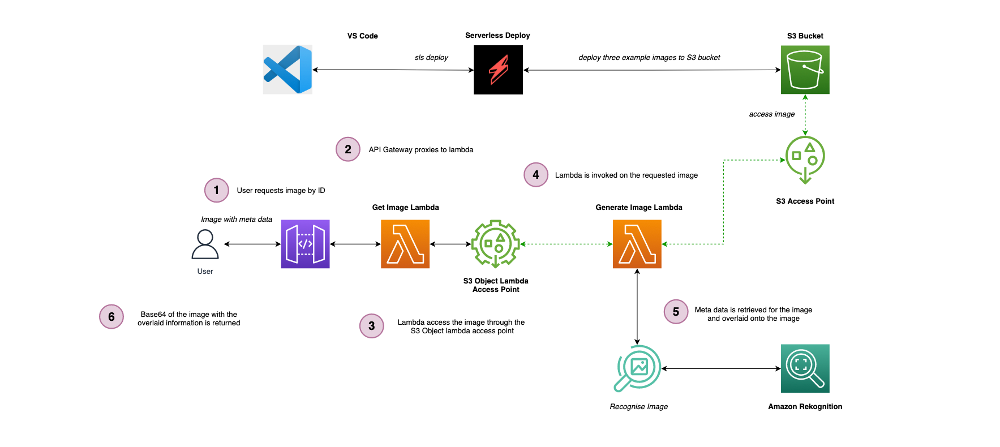

# serverless-s3-object-lambda

A practical example of using AWS S3 Object Lambda to watermark an image with meta data on the fly using Amazon Rekognition and AWS S3 Object Lambda, based on the following blog post [Serverless S3 Object Lambda 🚀](/)

## Introduction

The diagram below shows the architecture which we are building in the repo:

## Getting started

**Note: This will incur costs in your AWS account**

To get the project up and running, in the root of the folder run `npm i` which will install all of the dependencies.

## Deploying the services

To deploy the services run the following command in the root folder: `npm run deploy:develop` (_or equivelant for the environment your working with_)

## Removing the services

To remove the services run the following command in the root folder: `npm run remove:develop` (_or equivelant for the environment your working with_)

## Invoking the endpoints

Once deployed, you can invoke the endpoint using the postman file found here `./postman/`

## Image Reference

Burger photo by <a href="https://unsplash.com/@amir_v_ali?utm_source=unsplash&utm_medium=referral&utm_content=creditCopyText">amirali mirhashemian</a> on <a href="https://unsplash.com/s/photos/burger?utm_source=unsplash&utm_medium=referral&utm_content=creditCopyText">Unsplash</a>

City photo by <a href="https://unsplash.com/@henning?utm_source=unsplash&utm_medium=referral&utm_content=creditCopyText">Henning Witzel</a> on <a href="https://unsplash.com/s/photos/city?utm_source=unsplash&utm_medium=referral&utm_content=creditCopyText">Unsplash</a>

Dog photo by <a href="https://unsplash.com/@karsten116?utm_source=unsplash&utm_medium=referral&utm_content=creditCopyText">Karsten Winegeart</a> on <a href="https://unsplash.com/s/photos/dog?utm_source=unsplash&utm_medium=referral&utm_content=creditCopyText">Unsplash</a>
